# **Deploy Github Project to Vercel**

### 1. Buka vercel.com, Add new di bagian kanan & pilih Project

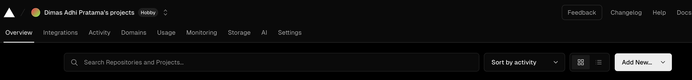

### 2. Dalam kolom search ketik nama project dan klik import

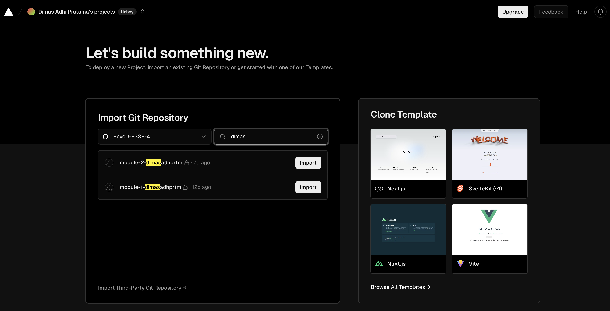

### 3. Klik Deploy di bagian bawah

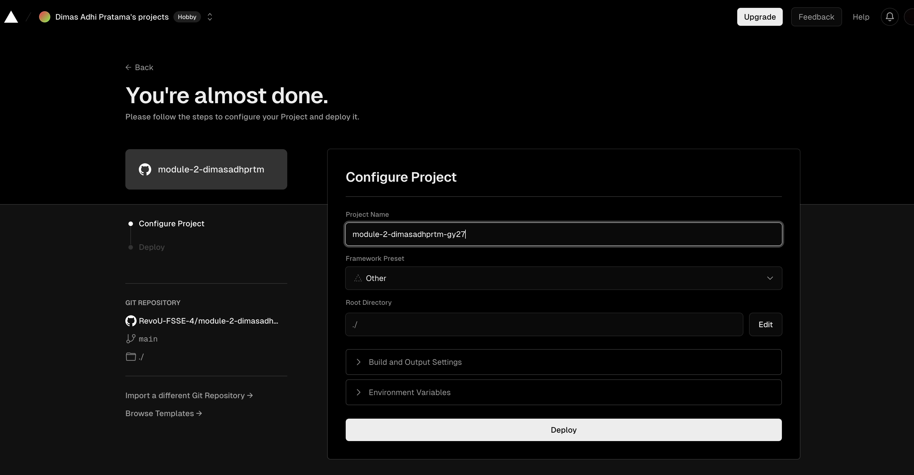

### 4. Jika sudah berhasil, klik Continue to Dashboard

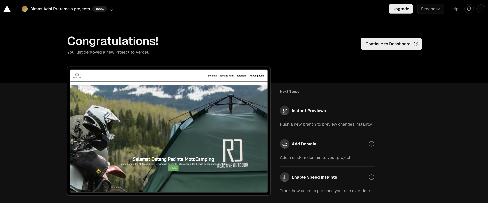

### 5. Setelah berhasil masuk ke dashboard, silahkan buka github untuk cek konektivitas Github to Vercel

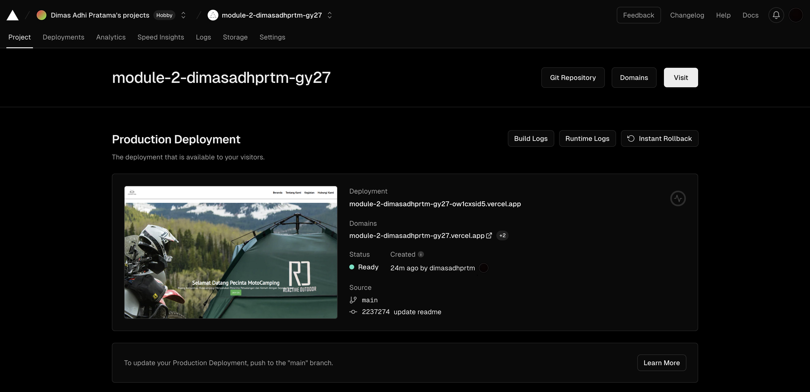

### 6. Pada bagian kanan di bawah _About_ akan ada link yang menandakan bahwa Github sudah berhasil deploy ke vercel dan auto deploy jika ada perubahan pada coding

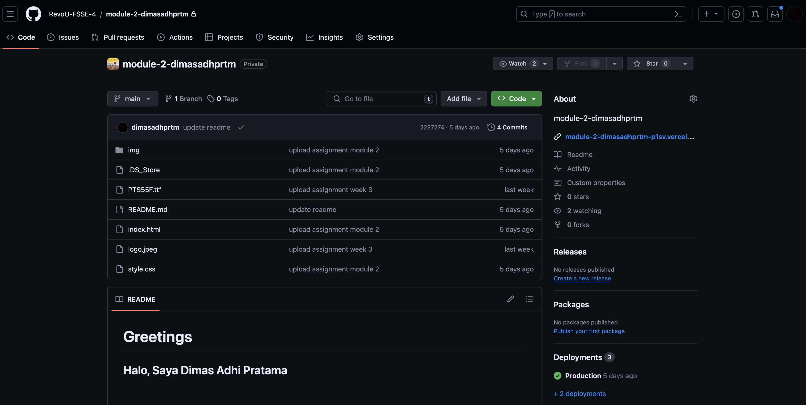    

# **Langkah membuat Domain di Hostinger**

### 1. Buka website hostinger.com lalu ketik **_Sign Up_** atau **_Log In_**

### 2. Jika sudah **_Sign Up_** atau **_Log In_** maka pilih **_Domains_** pada bagian navigation bar dan pilih **_Get a New Domain_** di bagian kiri. Buat Custom Domain pada kolom yang tersedia dan pilih search. Jika Custom Domain tersedia makan pilih **_Buy Now_**.

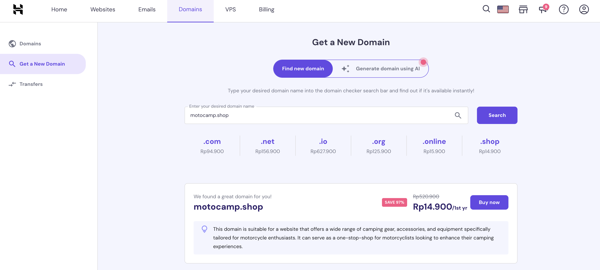

### 3. Pilih jangka waktu langganan custom domain dan pilih **Choose Payment Method** untuk melakukan pembayaran

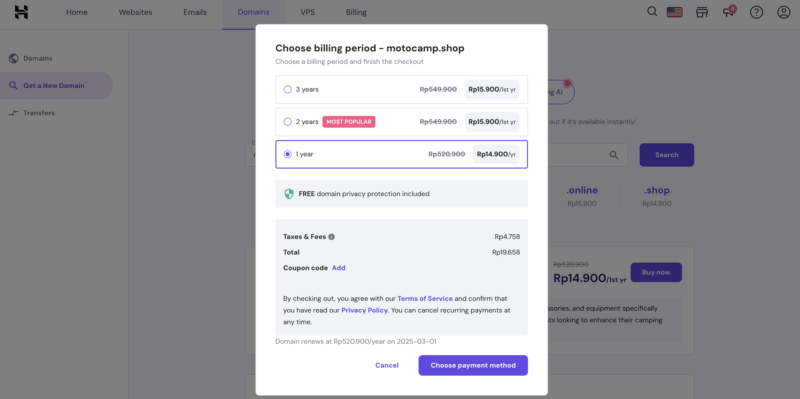

### 4. Pilih jenis pembayaran, sebagai contoh kita akan memilih pembayaran melalui QRIS

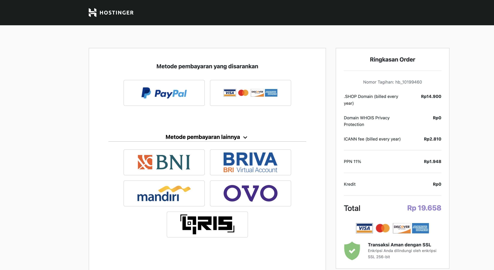

### 5. Jika sudah berhasil melakukan pembayaran maka akan muncul notifikasi pada layar web.

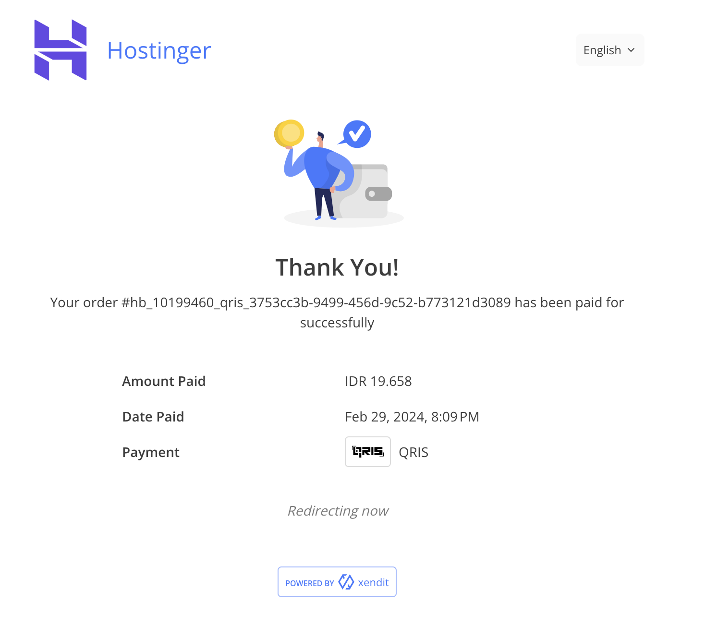

### 6. Akan muncul halaman untuk melengkapi registrasi domain. Klik Edit jika ada perubahan dan pilih **Finish Registration**

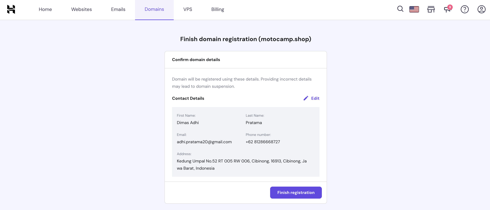

### 7. Jika sudah berhasil maka tampilan akan seperti halaman berikut.

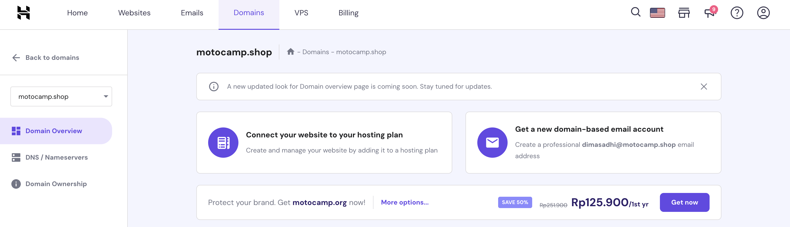   

# **Connect custom domain and DNS**

### 1. Buka website **cloudflare.com** lalu pilih **sign up** atau **Log In** dengan mengisi email dan password

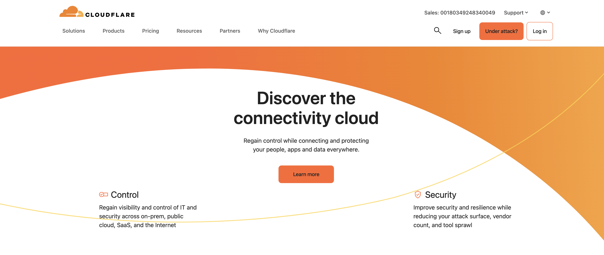

### 2. Jika sudah berhasil log in maka pilih tombol **Get Started** yang berwarna biru

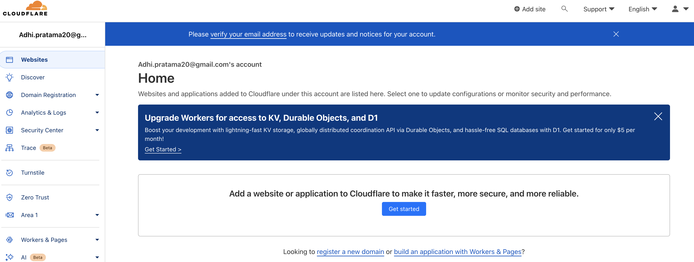

### 3.Masukkan nama custom domain yang sebelumnya sudah dibuat (di web hostinger), lalu klik **Continue**.

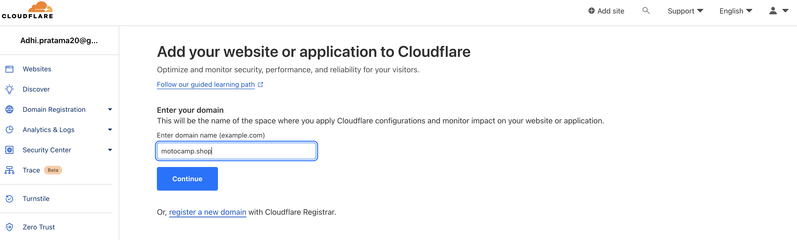

### 4. Scroll ke bawah bagian website lalu klik tabel **Free** dan klik **Continue**

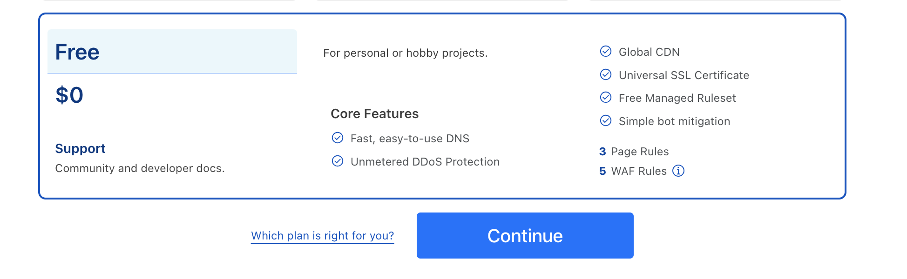

### 5.Jika sudah masuk pada halaman berikut, maka silahkan buka kembali vercel untuk copy beberapa elemen untuk diedit

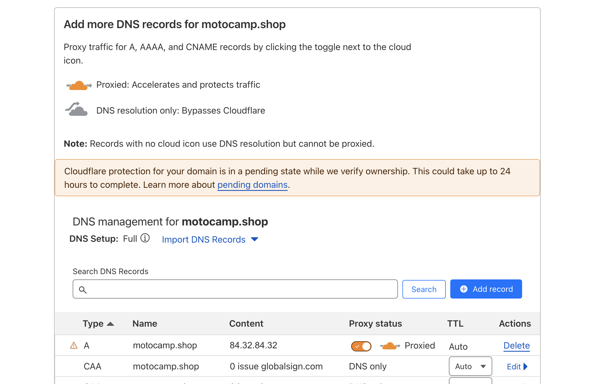

### 6. Buka halaman vercel dan klik **Domains** di kanan atas

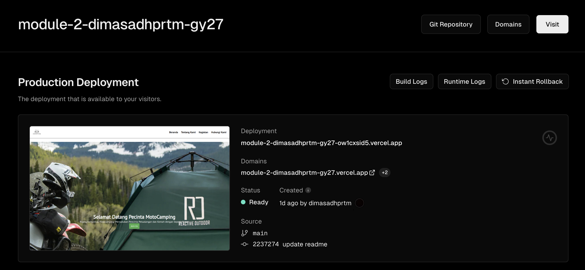

### 7. isi nama custom domain yang sudah dibuat pada kolom yang tersedia dan klik **Add**

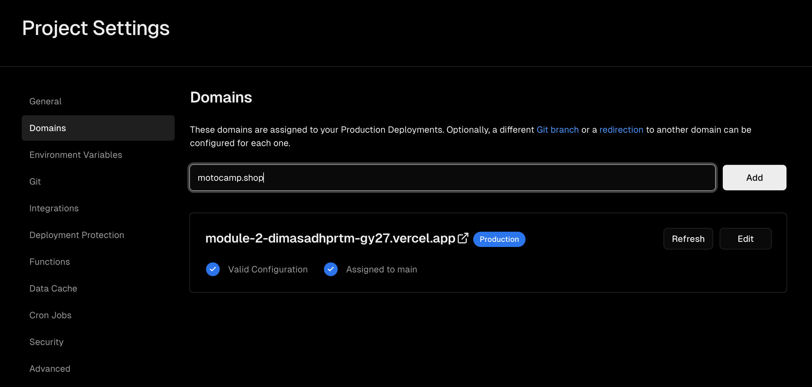

## 8. Pilih pada bagian atas yang direkomendasikan oleh vercel, lalu klik **Add**

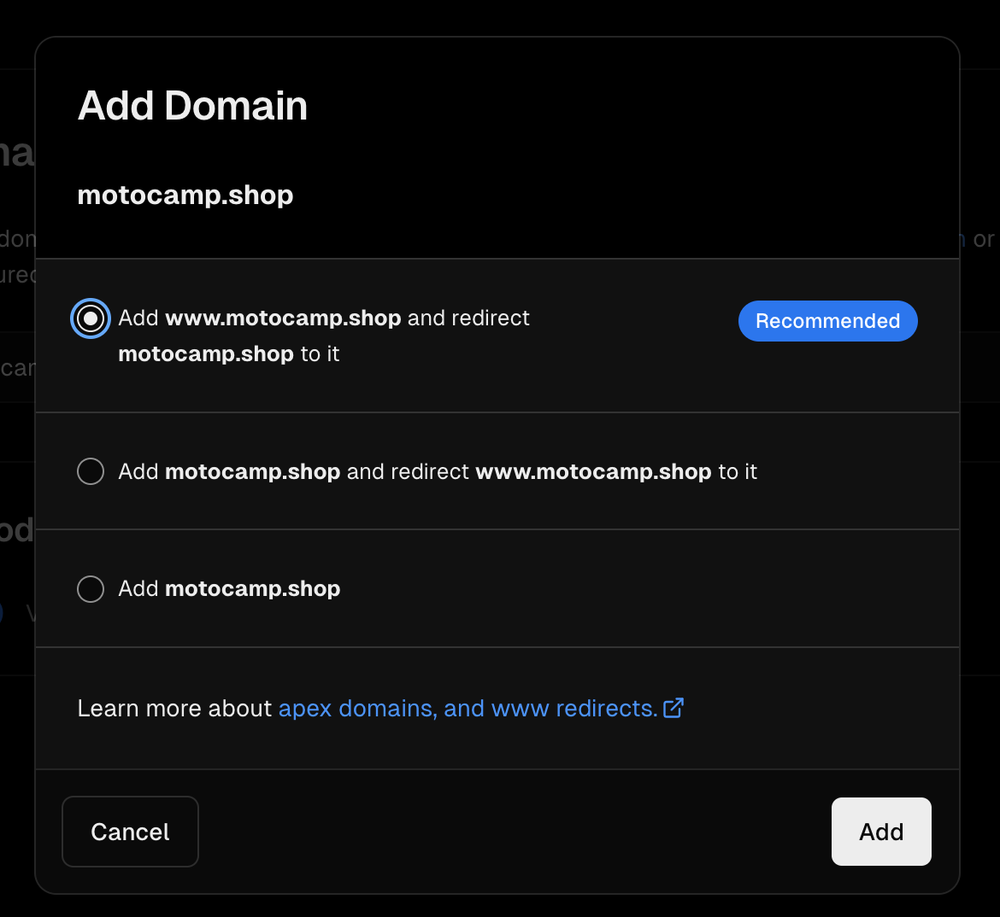

## 9.Jika sudah tampil halaman berikut maka ikuti tahap berikut :

- Klik edit untuk copy #A & #CNAME
- buka kembali cloudflare & sesuaikan #A & #CNAME sesuai dengan vercel
- klik \*\*Continue\*\*
- Buka kembali vercel dan harap menunggu maksimal 24 jam untuk prosesnya
  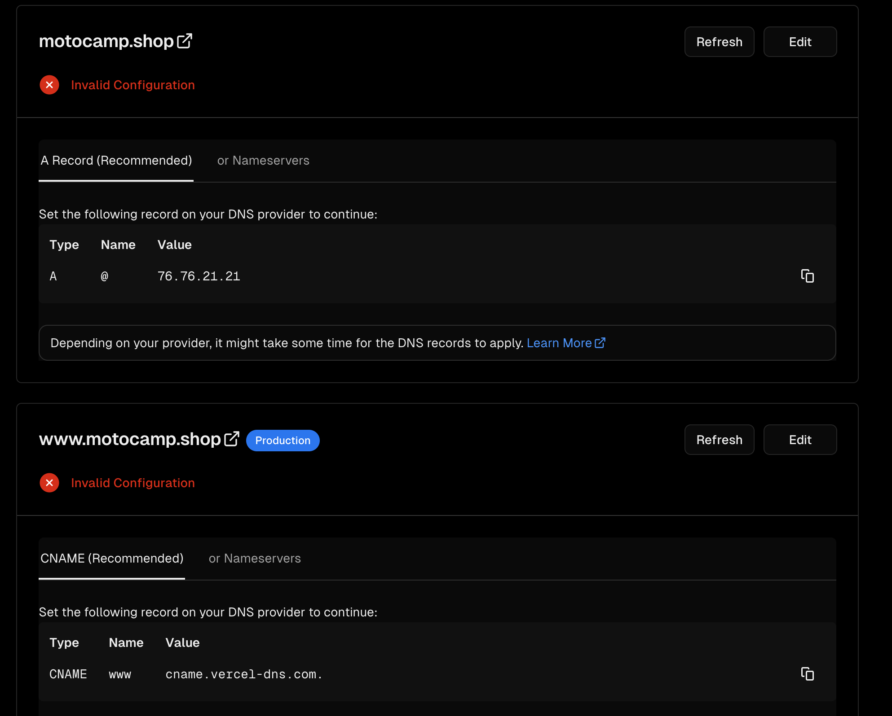
