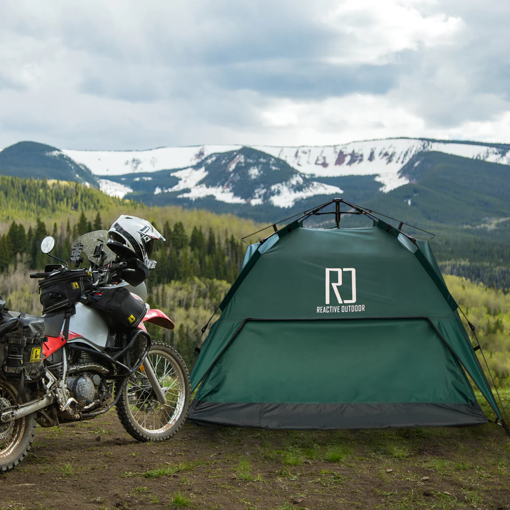

# **Greetings**

## Halo, Saya **Dimas Adhi Pratama**

 

### Saya ingin membuat website untuk komunitas Pecinta Motocamping

 

### 
 Dalam website ini nantinya akan ada :

1. Contoh kegiatan acara motocamping
2. Form untuk bertanya di bagian bawah

 
Website akan dibuat dalam beberapa tampilan agar responsive ketika dibuka melalui Desktop, Tablet & Handphone. Di bagian atas akan dibuat Sticky NavBar agar menu tetap berada di atas ketika halaman di scroll ke bawah.

 

 Jika memungkinkan menambahkan hamburger menu saat layar menjadi kecil / untuk tampilan Handphone.

 

#### Ini adalah link project yang sudah deploy menggunakan vercel : https://module-1-dimasadhprtm-jwz22i162-dimas-adhi-pratamas-projects.vercel.app/

#### Berikut Contoh Gambar yang akan diisi pada halaman website

